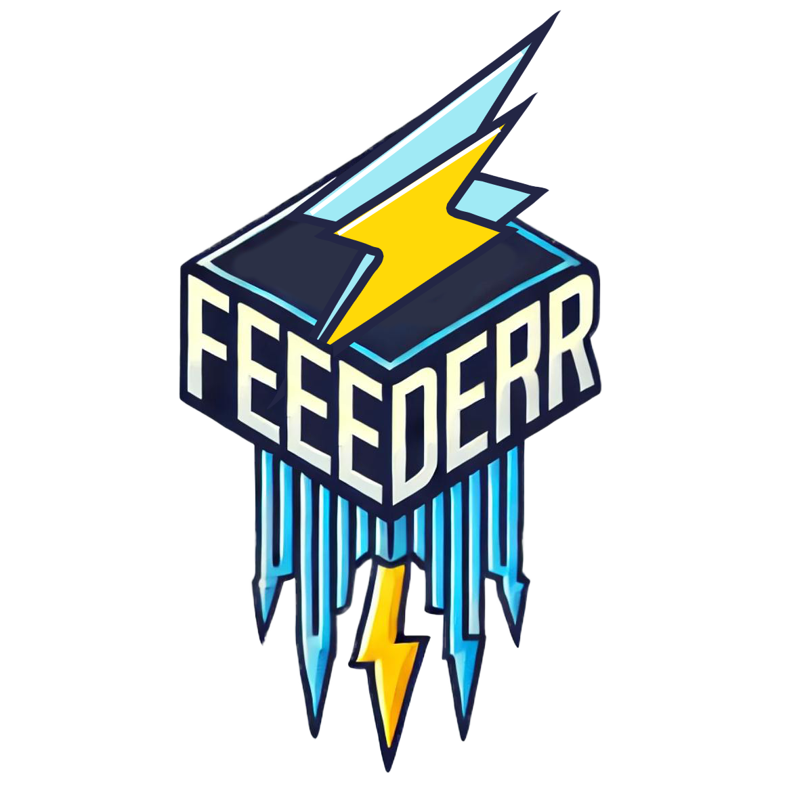

# Finding-Forwarder

<p align="center">
    
    
</p>

**Finding-Forwarder** is a service suite designed to fetch blockchain data, process it, and forward important findings to various notification channels such as Telegram, OpsGenie, and Discord. The suite consists of two main components:

1. **Feeder**: Fetches the latest blockchain data at regular intervals and publishes it to a specific NATS topic.
2. **Forwarder**: Listens to findings from bots, applies quorum and filtering, and forwards critical information to the appropriate notification channels.

This solution serves as an alternative to **[OpenZeppelin Defender](https://defender.openzeppelin.com/)** and **[Forta](https://app.forta.network/)**, providing features such as guaranteed message delivery and findings processing based on quorum.

## Components

- **[Feeder](./feeder.md)**: Fetches blockchain data and publishes it to a NATS topic.
- **[Forwarder](./forwarder.md)**: Receives findings from various bots, processes them, and forwards them to notification channels.
- **[Configuration](./config.md)**: Contains details on how to set up and configure the **Finding-Forwarder** system.
- **[notification.prod.sample.yaml](./notification.prod.sample.yaml)**: Dynamic notification config

## How It Works - Simplified Overview

> The following graphic represents how the infrastructure is set up on a single virtual machine. In practice, there are three such machines, and quorum is collected 2 out of 3 based on Redis.

```plaintext
+-----------------------------+
|        Blockchain           |
|   (Source of block data)    |
+--------------+--------------+
               |
               v
+-----------------------------+
|            Feeder           |
| Fetches blockchain data and |
| publishes to NATS topic     |
| (e.g., blocks.mainnet.l1)   |
+--------------+--------------+
               |
               v
+-----------------------------+
|           NATS Server       |
|  Manages data communication |
| between components          |
+--------------+--------------+
               |
               v
+-----------------------------+
|           Bots              |
| Subscribed to block data,   |
| process findings and send   |
| them to findings.<team>.<bot>|
+--------------+--------------+
               |
               v
+-----------------------------+
|          Forwarder          |
| Listens to findings topics, |
| applies quorum and filters, |
| and forwards notifications  |
| to configured channels like |
| Telegram, Discord, OpsGenie.|
+--------------+--------------+
               |
               v
+-----------------------------+
|     Redis (Quorum Storage)  |
|  Ensures that findings are  |
| processed only after quorum |
| is reached (e.g., 2 out of 3|
| forwarders must agree).     |
| Prevents duplicate sending  |
| and ensures consistency.    |
+-----------------------------+
```
### Explanation:
1. **Feeder** continuously fetches the latest blockchain data and publishes it to a specific NATS topic.
2. **Bots** subscribe to this topic, process the block data, and send their findings to topics like `findings.<team_name>.<bot_name>`.
3. **Forwarder Instances**: Forwarders listen to findings topics, process the data, and check for quorum.
    - Forwarders use **Redis** to store quorum-related data, ensuring that findings are only processed after the quorum (e.g., 2 out of 3 forwarders) is reached.
    - This mechanism also prevents duplicate sending, as only one instance will proceed once the quorum condition is satisfied.
4. **Redis** helps maintain state consistency, ensuring reliable and fault-tolerant processing of findings across the distributed setup.

## How to Develop

To set up a local development environment for **Finding-Forwarder**, follow these steps:

1. **Prerequisites**:
    - Install `go1.23.1+`
    - Clone the repository: `git clone <your-repo-url>`
    - Navigate to the root of the repository: `cd finding-forwarder`

2. **Install Tools and Dependencies**:
   ```bash
   make tools
   make vendor
   ```

3. **Environment Setup**:
    - Copy the `sample.env` file to `.env`:
      ```bash
      cp sample.env .env
      ```
    - Configure your environment variables as needed. Below is an explanation of the available environment variables:

      | Variable              | Description                                                                                       | Default Value                      |
           |------------------------|---------------------------------------------------------------------------------------------------|------------------------------------|
      | `READ_ENV_FROM_SHELL`  | Whether to read environment variables from the shell (useful for container setups).              | `false`                            |
      | `SOURCE`               | Source name for identifying where the forwarder is running.                                      | `local`                            |
      | `ENV`                  | The environment mode of the application.                                                         | `local`                            |
      | `APP_NAME`             | Name of the application.                                                                        | `finding_forwarder`               |
      | `PORT`                 | Port on which the application will run.                                                         | `8080`                             |
      | `LOG_FORMAT`           | Log format (`simple` or `json`).                                                                | `simple`                           |
      | `LOG_LEVEL`            | Log level (e.g., `debug`, `info`, `warn`, `error`).                                             | `debug`                            |
      | `BLOCK_TOPIC`          | NATS topic for the Feeder to publish blockchain data.                                           | `blocks.mainnet.l1`                |
      | `NATS_DEFAULT_URL`     | URL for connecting to the NATS server.                                                          | `http://service-forta-nats:4222`   |
      | `REDIS_ADDRESS`        | Address for connecting to the Redis instance.                                                   | `redis:6379`                       |
      | `REDIS_DB`             | Redis database index to use.                                                                    | `0`                                |
      | `QUORUM_SIZE`          | The number of confirmations required before forwarding a message.                              | `1`                                |
      | `JSON_RPC_URL`         | URL for connecting to the Ethereum JSON-RPC endpoint.                                           | `https://eth.drpc.org`             |

4. **Building and Running Bots**:
    - Clone the **Testing Forta Bots** repository:
      ```bash
      git clone https://github.com/lidofinance/testing-forta-bots/
      ```
    - Navigate to the `bots` directory and then into the specific bot you want to build, for example:
      ```bash
      cd testing-forta-bots/bots/ethereum-steth-v2
      ```
    - Build the Docker image for the bot:
      ```bash
      make generate-docker
      ```
    - After building the bot, return to the **Finding-Forwarder** project directory:
    - You can now add environment variables for the bot either directly in the `.env` file or pass them through the `docker-compose.yml` file.

5. **Start Services Using Docker Compose**:
   ```bash
   docker-compose up -d
   ```

### I want to develop finding-forwarder server or worker
1. comment forwarder-server or forwarder-worker in docker-compose file
2. provide env variable for application that it could connect to nats in docker
3. provide some bot for your purposes or run bot on local machine not in docker container

## Docs and rules
1. [App structure layout](./docs/structure.md)
2. [Code style](./docs/code_style.md)