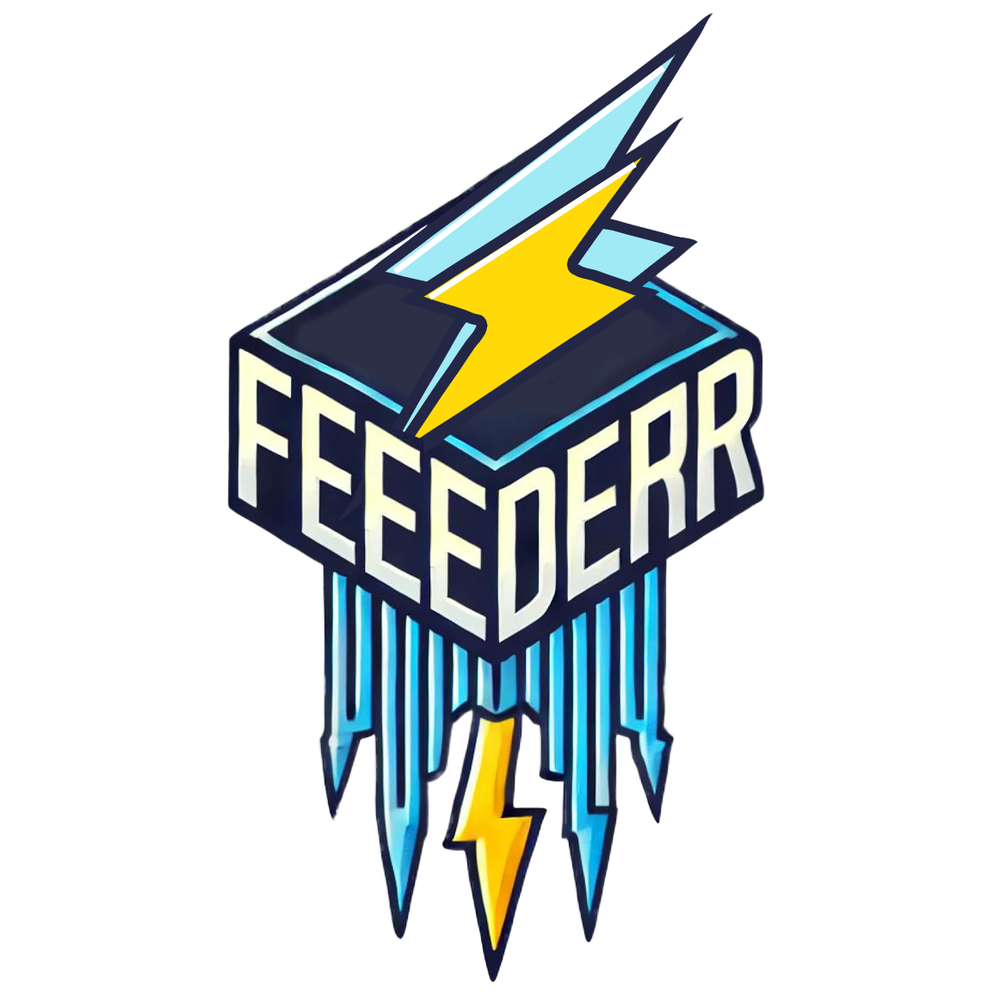
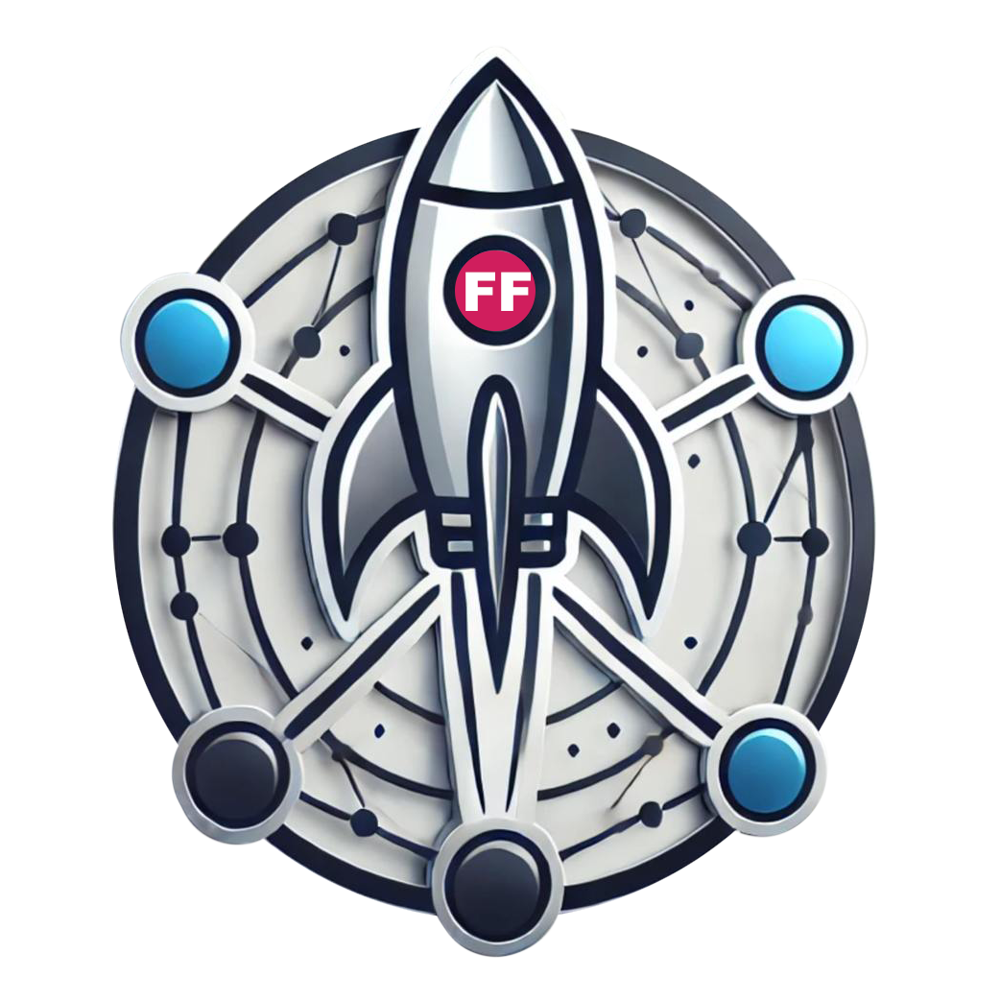

# Onchain-Mon

<p align="center">
    
    
</p>

**Onchain-Mon** (formerly `finding-forwarder`) is a service suite designed to fetch blockchain data, process it, and forward important findings to various notification channels such as Telegram, Discord, Slack and OpsGenie. The suite consists of two main components:

1. **Feeder**: Fetches the latest blockchain data at regular intervals and publishes it to a specific NATS topic.
2. **Forwarder**: Listens to findings from bots, applies quorum and filtering, and forwards critical information to the appropriate notification channels.

This solution serves as an alternative to **[OpenZeppelin Defender](https://defender.openzeppelin.com/)** and **[Forta](https://app.forta.network/)**, providing features such as guaranteed message delivery and findings processing based on quorum.

## Components

- **[Feeder](./feeder.md)**: Fetches blockchain data and publishes it to a NATS topic.
- **[Forwarder](./forwarder.md)**: Receives findings from various bots, processes them, and forwards them to notification channels.
- **[Configuration](./config.md)**: Contains details on how to set up and configure the **Onchain-Mon** system.
- **[notification.prod.sample.yaml](./notification.prod.sample.yaml)**: Dynamic notification config

## How It Works - Simplified Overview

> The following graphic represents how the infrastructure is set up on a single virtual machine. In practice, there are three such machines, and quorum is collected 2 out of 3 based on Redis.

```plaintext
+-----------------------------+
|        Blockchain           |
|   (Source of block data)    |
+--------------+--------------+
               |
               v
+-----------------------------+
|            Feeder           |
| Fetches blockchain data and |
| publishes to NATS topic     |
| (e.g., blocks.mainnet.l1)   |
+--------------+--------------+
               |
               v
+-----------------------------+
|           NATS Server       |
|  Manages data communication |
| between components          |
+--------------+--------------+
               |
               v
+-----------------------------+
|           Bots              |
| Subscribed to block data,   |
| process findings and send   |
| them to findings.<team>.<bot>|
+--------------+--------------+
               |
               v
+-----------------------------+
|          Forwarder          |
| Listens to findings topics, |
| applies quorum and filters, |
| and forwards notifications  |
| to configured channels like |
| Telegram, Discord, OpsGenie.|
+--------------+--------------+
               |
               v
+-----------------------------+
|     Redis (Quorum Storage)  |
|  Ensures that findings are  |
| processed only after quorum |
| is reached (e.g., 2 out of 3|
| forwarders must agree).     |
| Prevents duplicate sending  |
| and ensures consistency.    |
+-----------------------------+
```
### Explanation:
1. **Feeder** continuously fetches the latest blockchain data and publishes it to a specific NATS topic.
2. **Bots** subscribe to this topic, process the block data, and send their findings to topics like `findings.<team_name>.<bot_name>`.
3. **Forwarder Instances**: Forwarders listen to findings topics, process the data, and check for quorum.
    - Forwarders use **Redis** to store quorum-related data, ensuring that findings are only processed after the quorum (e.g., 2 out of 3 forwarders) is reached.
    - This mechanism also prevents duplicate sending, as only one instance will proceed once the quorum condition is satisfied.
4. **Redis** helps maintain state consistency, ensuring reliable and fault-tolerant processing of findings across the distributed setup.

## How to Develop

To set up a local development environment for **Onchain-Mon**, follow these steps:

1. **Prerequisites**:
    - Install `go1.26.5+` and Docker
    - Clone the repository: `git clone https://github.com/lidofinance/onchain-mon`
    - Navigate to the root of the repository: `cd onchain-mon`

2. **Install Tools and Dependencies**:
   ```bash
   make tools
   make vendor
   ```

3. **Environment Setup**:
    - Copy the `sample.env` file to `.env`:
      ```bash
      cp sample.env .env
      ```
    - Configure your environment variables as needed. Below is an explanation of the available environment variables:

      | Variable              | Description                                                                          | Default Value            |
      |-----------------------|--------------------------------------------------------------------------------------|--------------------------|
      | `READ_ENV_FROM_SHELL` | Read config from the shell instead of `.env` (docker-compose sets this to `true`).   | `false`                  |
      | `SOURCE`              | Instance identifier. **Must be unique per forwarder** — quorum breaks otherwise.      | `local`                  |
      | `ENV`                 | Environment mode. When it is not `local`, `notification.yaml` is read from `/etc/forwarder/`. | `local`          |
      | `APP_NAME`            | Name of the application; also the prefix for Prometheus metrics.                      | `onchain_mon`            |
      | `PORT`                | Port on which the application will run.                                               | `8080`                   |
      | `LOG_FORMAT`          | Log format (`simple` or `json`).                                                      | `simple`                 |
      | `LOG_LEVEL`           | Log level (e.g., `debug`, `info`, `warn`, `error`).                                   | `debug`                  |
      | `BLOCK_TOPIC`         | NATS topic for the Feeder to publish blockchain data.                                 | `blocks.mainnet.l1`      |
      | `NATS_DEFAULT_URL`    | URL for connecting to the NATS server.                                                | `http://localhost:4222`  |
      | `REDIS_ADDRESS`       | Address for connecting to the Redis instance.                                         | `localhost:6379`         |
      | `REDIS_DB`            | Redis database index to use.                                                          | `0`                      |
      | `QUORUM_SIZE`         | How many instances must see a finding before it is sent (prod: 2 of 3).               | `1`                      |
      | `JSON_RPC_URL`        | URL for connecting to the Ethereum JSON-RPC endpoint.                                 | `https://eth.drpc.org`   |
      | `BLOCK_EXPLORER`      | Block explorer used when building alert links.                                        | `etherscan.io`           |
      | `SENTRY_DSN`          | Sentry DSN. Leave empty to disable Sentry.                                            | *(empty)*                |

4. **Building and Running Bots**:
    - Clone the **Testing Forta Bots** repository:
      ```bash
      git clone https://github.com/lidofinance/testing-forta-bots/
      ```
    - Navigate to the `bots` directory and then into the specific bot you want to build, for example:
      ```bash
      cd testing-forta-bots/bots/ethereum-steth-v2
      ```
    - Build the Docker image for the bot:
      ```bash
      make generate-docker
      ```
    - After building the bot, return to the **Onchain-Mon** project directory:
    - You can now add environment variables for the bot either directly in the `.env` file or pass them through the `docker-compose.yml` file.

5. **Start Services**:
   ```bash
   make up          # mainnet stack: nats, redis, feeder, forwarder
   make logs        # follow the logs
   make down        # stop it
   ```

## Local Environments

Three stacks are available. `mainnet` and `prod` both bind Redis on `6379`, so they
cannot run at the same time; `testnet` uses its own ports and runs alongside either.

| Stack                | Start           | Stop              | Config                        | Ports (forwarder/feeder) |
|----------------------|-----------------|-------------------|-------------------------------|--------------------------|
| mainnet              | `make up`       | `make down`       | `.env`                        | 8081 / 8082              |
| testnet (Hoodi)      | `make up-testnet` | `make down-testnet` | `.env.testnet`            | 8083 / 8084              |
| prod-like (3 cells)  | `make up-prod`  | `make down-prod`  | `.env`                        | internal only            |

`make down-all` stops everything. Each stack has a `logs-*` target as well.

The prod-like stack mirrors production: three cells, each with its own NATS, feeder
and forwarder, sharing one Redis so quorum (2 of 3) is collected across them. Its
`steth-*` bots need a private image and are excluded from `make up-prod`.

Shared `redis`/`nats` definitions live in `docker-compose.base.yaml` and are pulled
in via `extends`. Local runtime state (JetStream data, bot DBs) lives in `infra/`
and is gitignored — only `infra/nats/nats.conf` is tracked.

### Testing

```bash
make test        # safe: no network, no credentials
make test-live   # hits real RPC and posts to real channels — use deliberately
make lint
make check-format
```

Tests that need credentials sit behind the `live` build tag. `internal/pkg/consumer`
tests need Redis on `127.0.0.1:6379` and skip themselves when it is unavailable.

### I want to develop feeder or forwarder locally
1. Comment out the corresponding service in `docker-compose.yml`
2. Point its env at the dockerized NATS/Redis (`localhost:4222`, `localhost:6379`)
3. Run a bot for your purposes, either locally or in a container

## Docs and rules
1. [App structure layout](./docs/structure.md)
2. [Code style](./docs/code_style.md)
3. [Changelog](./Changelog.md)

CI (`.github/workflows/checks.yml`) runs format, lint, vulncheck, tests against a
Redis service and a docker image build on every pull request.
