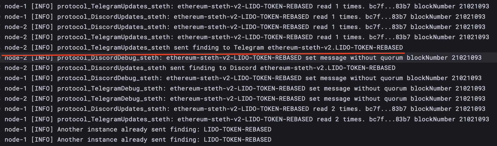

# Forwarder
<div style="display: flex; align-items: flex-start;">
    
    <p>
        <strong>Forwarder</strong> is a component of the <strong>finding-forwarder</strong> software suite. It is a service designed to receive and process data from various sources (NATS subjects) sent by bots, and subsequently send notifications to different delivery channels such as Telegram, Discord, and OpsGenie. The service ensures reliable processing and filtering of events (findings) using quorum, guaranteeing that important notifications are delivered only after receiving the necessary number of confirmations.
        <br><br>
        The <strong>Forwarder</strong> project serves as an alternative to <a href="https://defender.openzeppelin.com/"><strong>OpenZeppelin Defender</strong></a> and <a href="https://app.forta.network/"><strong>Forta</strong></a>, providing features such as guaranteed message delivery and <a href="brief/databus/finding.dto.json"><strong>findings</strong></a> processing based on quorum. Forwarder is flexibly configured via configuration files and supports integration with popular notification channels.
    </p>
</div>

### Current Deployment
At present, **Forwarder** operates in three instances running on three different virtual machines. The system is set to gather a quorum of **2 out of 3**, which means that a finding must be confirmed by at least two instances before it is processed and delivered. This configuration ensures redundancy and reliability, allowing the system to tolerate failures while still ensuring message delivery.

## Finding Object
[Ex-Forta bots](https://github.com/lidofinance/testing-forta-bots/tree/main/bots) connected to the system send messages containing information about detected findings in JSON format. Here is an example of the **Finding** object structure:

```json
{
  "$schema": "http://json-schema.org/draft-07/schema#",
  "title": "Finding",
  "type": "object",
  "properties": {
    "severity": {
      "$ref": "#/definitions/Severity"
    },
    "alertId": {
      "type": "string"
    },
    "name": {
      "type": "string"
    },
    "description": {
      "type": "string"
    },
    "uniqueKey": {
      "type": "string"
    },
    "blockTimestamp": {
      "type": "integer"
    },
    "blockNumber": {
      "type": "integer"
    },
    "findingBotTimestamp": {
      "type": "integer"
    },
    "txHash": {
      "type": "string"
    },
    "botName": {
      "type": "string"
    },
    "team": {
      "type": "string"
    }
  },
  "required": ["severity", "alertId", "name", "description", "botName", "team"],
  "definitions": {
    "Severity": {
      "type": "string",
      "enum": ["Unknown", "Info", "Low", "Medium", "High", "Critical"]
    }
  }
}
```

## How Forwarder Works

1. **Receiving Messages from NATS Subjects:**
    - Each bot sends findings to NATS topics using the scheme: `findings.<team_name>.<bot_name>`. For example, `findings.protocol.steth`.
    - **Forwarder** automatically subscribes to these channels, creating independent subscriptions for each bot. This allows flexible processing of messages from different teams and systems.
    - Subscription, consumer and channels settings are configured ([detail explanation](./config)) in the [configuration yaml file](./notification.prod.sample.yaml). Prod yaml based in [ansible repo](https://github.com/lidofinance/ansible-onchain-mon-infra/blob/main/ansible/roles/onchain_mon/templates/notification.yaml.j2).

2. **Filtering and Processing Messages:**
    - Each consumer is configured to process messages with specific levels of importance (severity). For example, a consumer can be set up to process only messages with `Low`, `Medium`, `High`, and `Critical` severity levels.
    - If the consumer is set with the `by_quorum: true` flag, messages will be processed and sent only after quorum is reached — confirmation from multiple sources.

3. **Using Quorum:**
    - The **quorum system** uses Redis to store counters and message statuses. Each time a message with the same unique key arrives, the counter increases.
    - If the counter reaches the required quorum size, the message is sent to the designated channel.
    - Redis is used for reliable and fast quorum processing and to prevent duplicate sending.

4. **Retry Mechanism and Prevention of Duplicate Sending:**
    - If an attempt to send a finding to Telegram, Discord, or OpsGenie fails (e.g., due to a network error or service unavailability), **Forwarder** uses a replay mechanism powered by Nats.
    - Forwarder records the sending status in Redis so that other instances of the application can determine whether the message was successfully sent.
    - If another instance detects that the message was not successfully sent, it will attempt to set a lock in Redis to prevent double-sending and will try to send the message again.
    - This ensures that even in the case of network issues or other problems, findings are delivered, and notifications are not lost.

## YAML Configuration

**Forwarder** is configured using a YAML configuration file. Here is an example of a consumer configuration:

```yaml
consumers:
  - consumerName: TelegramUpdates
    type: Telegram
    channel_id: TelegramUpdatesId
    severities:
      - Low
      - Medium
      - High
      - Critical
    by_quorum: true
    subjects:
      - findings.protocol.steth
      - findings.protocol.arb
      - findings.protocol.opt
```

**Explanation:**
- **consumerName:** A unique name for the consumer that identifies it in the system.
- **type:** The type of channel to which notifications will be sent (e.g., Telegram).
- **channel_id:** The reference to the channel set up for sending messages.
- **severities:** The severity levels that the consumer will process.
- **by_quorum:** A flag indicating whether the message will only be sent after the quorum is reached.
- **subjects:** NATS topics that the consumer subscribes to.

## Forwarder Algorithm
1. **Checking for Successful Delivery:**
    - After an attempt to send a message, Forwarder updates the delivery status in Redis so that other instances know if the message was sent successfully.
    - If the delivery failed, the status remains unchanged, and the message stays in the queue for retry.

2. **Attempted Retry by Another Instance:**
    - Other Forwarder instances can detect that the message was not delivered and will try to set a lock to prevent double-sending.
    - If the lock is set successfully, the new instance retries sending the message, ensuring that it is eventually delivered.

3. **Redis and TTL:**
    - The mechanism using Redis also helps manage message lifespan and clears unnecessary data using TTL (Time To Live).

## Example of Operation:
1. A bot named `steth` sends a finding to `findings.protocol.steth`.
2. Forwarder receives the message, checks its severity level, and applies quorum if required.
3. If the quorum is reached or the `by_quorum` flag is not set, the message is sent to the Telegram channel via the configured consumer `TelegramUpdates`.
4. If the sending fails, other Forwarder instances attempt to resend the message, preventing message loss.

## How does it look in grafana:
